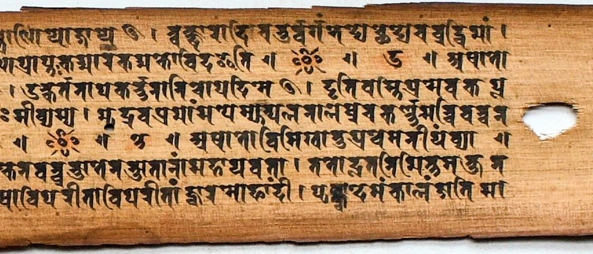

{: width="50%" style="float: left; margin-right: 2em;"} 
This is a project focussed on the critical study of the earliest manuscripts of the *Compendium of Suśruta*, a medical encyclopedia composed in Sanskrit two millennia ago󠇟󠇠󠇡󠇢󠆡󠄠󠅔︆󠆌󠆓󠇡󠄫󠇣󠄤󠅑󠅖󠆏󠅪󠆆󠅞󠆬󠇮󠇏󠇢󠅄󠅪󠇘󠅐︁󠇖󠇠󠆏󠄺󠆧󠇉󠆷󠅞󠆕󠅹󠄿󠇬󠆉󠆤󠆥.󠄳󠄢󠅀󠄱󠅄󠅈󠅄︀︁︀︀︈󠄉︀︀︈󠄉󠅚󠅥󠅝󠅒󠅫󠄒󠅓󠅟󠅣󠅕󠅏󠅣󠅙󠅗󠅞󠄡󠄒󠄪󠄒󠅘󠄵󠄿󠅘󠄱󠅃󠅕󠅗󠅇󠅁󠅆󠄛󠅠󠅇󠅘󠄱󠅉󠄢󠄩󠅥󠅔󠄷󠅆󠄤󠅔󠄸󠅗󠅠󠅑󠄸󠅂󠄠󠅓󠄸󠄽󠄦󠄼󠅩󠄩󠅚󠄽󠅞󠄲󠅘󠄼󠅝󠄩󠅩󠅊󠅩󠄩󠅪󠅉󠄢󠅘󠅜󠅒󠅇󠄶󠅪󠄼󠄣󠅉󠅩󠄼󠅚󠄽󠅦󠅉󠅪󠄺󠅧󠅉󠅃󠄥󠅡󠅓󠄢󠄩󠅥󠅒󠄷󠅂󠅢󠅑󠅇󠄥󠅪󠅔󠄷󠄶󠅥󠅉󠄢󠅆󠅖󠅑󠅇󠅂󠄤󠄺󠄴󠄹󠅩󠄽󠄴󠅓󠄠󠅊󠅄󠅂󠅚󠄼󠅄󠄹󠄤󠄽󠅪󠅅󠅤󠄾󠄴󠅛󠄠󠄽󠅃󠄠󠄥󠄽󠅝󠄵󠅩󠄼󠅄󠄽󠄥󠅊󠄴󠅅󠄢󠅊󠅚󠅓󠄠󠅉󠅪󠅊󠅛󠅊󠅝󠅤󠅚󠅒󠄷󠄶󠅠󠅒󠅆󠄩󠅣󠅉󠅇󠄺󠅜󠅒󠄷󠄡󠅚󠄽󠅞󠄲󠅘󠄼󠅝󠄾󠅣󠅉󠅇󠅜󠅤󠄼󠅞󠅉󠅩󠅒󠄢󠄾󠅣󠅉󠅇󠅜󠅤󠅈󠄢󠅔󠅜󠅒󠅝󠅆󠅩󠅉󠅈󠅂󠅦󠅓󠅞󠅗󠅔󠅊󠅇󠄥󠅚󠅕󠅈󠄲󠅟󠅊󠅈󠄹󠅤󠅊󠅇󠄥󠄠󠅊󠅈󠄺󠅧󠅓󠅝󠅜󠅪󠅊󠅃󠄡󠅘󠅓󠄷󠅛󠅦󠄽󠅃󠄤󠅧󠄼󠅚󠄺󠅡󠅉󠅈󠄾󠅪󠅊󠅈󠄺󠄠󠅑󠅇󠄩󠅥󠅓󠄤󠅑󠅚󠅊󠅇󠅨󠅘󠅉󠅝󠅆󠅣󠅒󠄢󠄽󠅩󠅓󠄷󠄵󠅥󠅉󠅇󠄾󠄠󠅑󠅇󠄩󠅥󠅓󠅩󠄥󠄢󠄽󠅝󠅂󠅛󠅉󠅈󠅂󠅘󠅟󠅇󠅔󠅘󠅉󠄣󠅂󠅠󠅒󠄢󠄥󠅪󠅗󠅡󠄾󠅜󠅒󠄷󠄶󠅙󠅊󠅇󠅨󠅣󠅉󠅪󠄺󠅧󠅉󠅃󠄥󠅚󠅓󠅝󠅆󠅘󠅔󠄷󠅆󠅛󠅊󠄸󠅔󠅟󠅊󠅇󠄥󠄠󠄽󠅚󠄱󠅩󠄾󠅙󠄠󠅧󠄽󠅩󠄠󠅧󠄾󠅜󠅁󠅩󠄽󠅄󠅟󠅩󠄽󠅪󠅟󠄠󠄾󠄡󠅠󠅤󠅓󠄢󠄩󠅝󠅔󠄸󠅔󠅘󠅓󠅝󠅆󠄲󠅊󠄢󠅆󠅥󠅔󠄸󠅔󠄶󠅒󠅝󠄾󠄥󠅓󠄷󠅘󠅜󠅓󠅙󠄲󠄶󠅒󠅞󠅂󠅜󠅓󠅞󠄲󠅩󠅑󠅈󠄾󠅜󠄹󠄵󠄶󠅁󠅃󠅑󠅂󠅜󠅒󠄷󠄶󠅙󠅊󠅇󠅨󠅧󠅉󠅪󠄺󠅧󠅉󠅃󠄥󠄣󠅉󠅈󠅂󠅜󠅓󠅝󠄡󠅘󠅓󠅝󠅤󠅜󠅊󠄷󠅂󠄣󠅑󠄷󠅆󠅥󠅔󠄴󠄹󠅧󠄽󠅚󠅉󠅤󠄽󠄴󠄽󠅤󠄽󠄴󠅊󠅅󠄽󠅚󠄵󠄦󠄽󠅚󠄽󠄦󠄾󠄴󠅔󠅑󠅒󠅈󠄾󠅦󠅊󠅞󠅂󠄣󠅉󠅈󠄺󠅜󠅁󠅇󠅔󠅜󠅒󠅞󠅂󠄤󠄸󠅇󠅆󠅥󠅉󠄣󠅜󠅧󠅑󠄷󠅆󠅩󠄼󠅇󠅆󠅥󠅔󠄷󠅆󠅩󠅓󠄸󠄺󠅠󠅓󠄢󠅅󠅤󠅉󠅈󠄲󠅠󠄼󠅪󠄵󠅥󠄽󠄳󠄤󠅩󠅑󠄢󠅂󠅜󠅓󠄢󠄾󠅩󠅑󠅈󠄲󠄠󠅑󠅇󠄩󠅥󠅕󠄳󠄩󠅅󠅊󠅈󠅘󠄠󠄹󠄷󠅆󠅤󠅉󠅝󠅆󠅛󠅊󠄷󠅆󠅛󠄹󠄸󠅔󠅠󠅔󠄷󠅗󠅗󠅆󠅇󠄥󠅠󠅉󠄢󠄩󠅛󠅊󠅃󠄲󠄢󠅉󠅈󠄺󠅠󠅉󠅈󠅂󠅠󠅒󠄢󠄤󠅗󠅓󠄢󠅆󠅣󠅊󠅇󠄾󠄠󠅒󠄣󠄺󠅪󠄼󠅝󠅂󠅢󠅑󠅇󠄥󠅛󠅊󠄠󠄶󠅚󠅔󠄷󠅜󠅦󠅒󠅞󠄿󠅚󠅊󠅇󠅨󠅘󠅉󠅝󠅆󠅣󠅒󠅇󠄽󠅩󠅓󠄷󠄵󠅥󠅒󠅇󠅆󠄠󠅉󠅇󠅂󠅘󠅔󠄷󠄶󠅛󠅊󠄷󠄶󠄠󠅉󠅑󠅆󠅟󠅁󠄷󠄾󠅦󠅒󠅞󠅂󠅜󠅕󠄸󠅂󠅩󠅑󠄸󠅂󠄠󠅓󠄸󠄽󠄦󠄼󠅩󠄩󠅪󠅉󠄢󠅘󠅜󠅒󠅇󠄵󠅥󠅒󠄣󠄺󠅞󠅊󠅅󠄲󠄠󠅕󠅈󠄲󠅜󠅒󠄵󠄾󠅩󠅊󠅇󠄶󠄠󠅑󠅈󠅊󠅜󠅆󠄢󠄩󠅩󠅑󠄢󠅠󠅠󠅊󠄷󠅆󠅥󠅔󠄷󠅜󠅝󠅑󠅇󠅆󠅩󠅓󠅇󠅂󠅦󠅉󠄡󠄨󠅨󠄾󠅪󠅓󠅩󠄿󠄴󠄽󠅩󠄽󠅚󠄹󠄣󠄽󠄴󠄽󠄥󠅊󠄷󠄥󠅘󠅒󠅇󠅆󠅨󠅊󠄷󠄩󠅚󠅈󠅪󠄵󠄣󠄾󠅪󠄹󠄤󠄽󠅪󠄹󠅩󠄽󠅚󠅓󠅧󠄽󠅪󠅜󠅠󠅓󠄸󠅆󠅙󠅒󠄷󠅜󠅪󠅑󠄷󠅆󠅩󠅟󠅝󠅆󠄱󠅔󠄸󠅜󠅧󠅊󠅇󠅨󠅀󠅓󠅝󠅔󠅘󠅒󠅝󠅜󠄦󠅉󠅈󠅂󠅠󠅒󠄢󠄥󠅡󠅑󠅇󠅂󠅜󠅒󠅞󠅂󠅠󠅊󠅝󠅜󠅜󠅓󠅞󠄲󠅁󠅊󠅈󠄺󠅪󠅒󠄢󠄥󠅘󠅒󠄳󠄲󠄲󠅉󠄢󠄾󠅦󠅔󠅇󠄥󠄠󠅊󠄷󠅤󠅠󠅒󠅝󠅂󠅟󠅄󠅇󠅆󠄠󠅉󠅇󠅂󠅘󠅔󠄷󠄷󠅚󠅊󠅇󠅨󠅘󠅉󠅝󠅆󠅣󠅓󠄢󠄩󠅩󠅊󠅩󠄥󠅜󠅒󠅝󠄾󠄥󠅓󠄷󠅘󠅜󠅓󠅙󠄥󠅪󠅔󠄷󠄶󠄠󠅔󠅈󠄾󠅛󠅊󠄷󠄶󠄠󠅉󠅑󠄺󠄠󠅓󠄣󠅂󠅘󠅔󠄸󠅆󠅪󠅄󠄷󠅜󠅪󠅔󠄵󠄾󠅩󠅊󠅇󠅂󠅜󠅒󠅞󠅂󠅠󠅉󠅇󠅨󠄤󠅅󠅝󠅘󠄠󠅔󠄸󠄲󠅪󠄿󠅙󠄨󠅦󠅔󠅝󠅆󠅩󠅑󠅇󠅊󠄥󠄼󠅝󠅆󠅥󠅉󠄣󠅜󠅧󠅑󠄷󠅆󠅩󠅉󠅇󠅛󠅥󠅉󠄢󠄩󠅤󠄼󠄣󠄾󠄠󠅉󠅈󠅂󠄡󠅓󠅩󠄩󠄢󠄽󠅃󠄩󠅣󠅑󠅈󠄾󠄠󠅓󠅩󠄨󠄣󠅉󠅪󠅁󠅩󠄾󠅄󠄾󠅜󠄽󠄳󠄠󠄤󠅊󠅄󠅅󠅨󠄼󠅄󠅁󠄠󠅉󠅝󠅁󠅤󠄿󠅄󠄲󠅚󠄾󠄳󠄡󠅛󠄾󠅪󠄵󠄣󠄽󠅚󠅁󠅨󠄽󠄢󠄽󠄥󠄾󠄷󠅊󠅦󠅓󠄣󠅂󠅘󠅔󠄸󠅆󠅪󠅄󠄷󠅜󠅪󠅔󠄵󠅜󠅥󠅊󠄷󠅆󠄤󠅉󠅄󠄲󠅛󠅑󠄢󠅜󠅥󠅊󠄷󠄩󠄴󠅔󠅈󠄾󠄠󠅒󠄢󠄡󠄲󠅓󠄣󠄾󠅜󠅓󠅞󠅂󠅠󠅒󠄢󠄦󠅚󠅊󠅇󠅨󠅘󠅉󠅝󠅆󠅣󠅔󠅝󠄾󠅦󠅒󠅃󠄥󠅜󠅒󠅝󠄾󠄥󠅓󠄷󠅘󠅜󠅓󠅙󠄥󠅤󠅊󠅈󠄺󠅢󠅒󠄷󠅅󠅥󠅔󠅚󠄶󠅛󠅊󠄷󠄶󠄠󠅉󠅑󠅂󠅠󠅓󠅝󠄩󠅦󠅔󠄶󠄩󠅟󠅉󠅈󠄾󠅟󠅕󠄵󠄲󠅛󠄾󠅄󠅗󠄥󠄾󠄢󠄺󠅙󠄽󠅚󠄱󠅪󠄿󠅄󠅘󠅝󠄿󠄴󠅗󠅨󠅉󠅚󠄹󠄣󠅊󠅇󠅁󠄤󠄽󠅇󠄾󠅛󠄿󠅇󠄺󠅛󠅉󠅚󠄱󠅨󠄽󠄴󠄶󠅝󠄽󠅪󠄽󠅩󠅊󠅚󠄹󠅩󠄾󠅝󠄾󠅘󠅉󠅄󠄵󠅨󠅉󠅄󠅘󠅚󠅊󠅝󠅆󠅙󠄽󠅇󠅅󠅪󠄽󠅇󠄶󠅝󠄾󠅪󠄹󠅨󠄽󠅪󠄾󠅛󠅒󠅞󠅂󠅦󠅔󠄷󠄶󠅣󠅈󠄣󠄾󠅜󠅊󠄢󠄡󠅜󠅒󠅞󠅂󠅪󠄱󠅇󠅔󠅩󠅒󠄢󠄩󠄠󠅈󠄢󠅜󠅛󠅕󠄳󠅁󠄢󠄾󠄷󠅁󠄣󠄿󠄷󠅆󠅝󠄽󠅩󠄠󠅨󠄽󠅪󠅉󠅩󠄼󠅄󠅁󠅨󠅉󠅇󠅁󠅤󠄿󠅇󠅂󠅘󠅉󠅙󠄠󠄥󠄽󠅚󠄶󠅚󠄾󠅪󠄹󠄠󠄿󠅄󠅘󠅝󠅊󠅇󠅆󠅩󠅓󠄢󠅆󠅞󠅒󠅇󠅆󠅥󠅔󠄷󠄶󠄠󠅑󠅇󠄩󠅥󠅈󠄢󠅨󠅜󠅔󠅝󠅆󠅣󠅑󠅈󠄲󠅘󠅓󠅝󠄶󠅞󠅓󠅝󠄶󠅧󠅑󠄷󠅂󠅢󠅑󠅇󠄥󠅛󠅒󠄠󠄾󠄡󠅓󠄣󠅂󠅦󠅒󠅅󠄶󠅪󠅓󠄢󠅆󠅩󠅔󠄷󠅜󠅦󠅒󠅡󠄾󠅜󠅒󠄷󠄶󠅙󠅊󠅇󠅨󠅨󠅉󠅪󠄺󠅧󠅉󠅃󠄥󠅟󠅉󠅈󠄾󠅟󠄼󠅝󠅂󠅘󠅔󠄷󠄵󠅥󠅔󠅚󠄶󠅛󠅊󠄷󠄶󠄠󠅉󠅑󠄾󠅛󠅑󠄷󠄶󠅪󠅑󠄸󠅘󠄱󠄾󠄢󠄾󠅝󠄽󠅝󠄵󠅩󠄽󠅚󠄾󠅜󠄽󠅝󠄹󠄢󠄾󠄷󠄾󠅙󠄾󠅄󠄲󠅛󠄿󠅄󠅜󠅜󠄽󠅝󠅂󠅙󠄽󠅚󠅗󠅪󠅉󠅝󠅊󠅝󠅉󠅝󠅉󠄡󠄿󠅄󠅓󠅧󠄿󠅄󠅁󠄢󠄾󠅇󠅉󠅪󠄽󠅚󠅛󠅩󠄿󠄴󠅓󠄥󠄽󠄴󠄱󠄡󠄾󠄴󠅂󠅚󠅊󠅄󠅁󠅩󠄽󠄴󠄹󠅧󠄽󠄷󠅅󠅩󠄾󠅇󠄾󠅘󠅒󠄷󠅔󠅝󠅓󠄢󠅘󠅘󠄽󠅚󠅅󠄢󠅑󠅝󠅆󠄤󠅉󠄢󠅨󠄡󠅓󠄢󠅜󠅦󠅒󠅞󠄿󠄲󠅟󠅝󠅆󠅪󠅔󠄷󠄶󠅩󠅔󠄲󠅛󠄲󠅇󠄷󠅊󠅣󠅊󠅇󠄥󠅞󠅔󠄷󠅗󠅊󠄹󠄺󠄾󠅛󠅑󠄢󠅜󠅥󠅊󠄷󠅤󠄴󠅒󠄢󠄥󠄠󠅊󠅇󠄥󠄠󠅃󠄷󠄶󠅪󠅑󠄻󠄾󠅜󠅒󠄷󠄶󠅙󠅊󠅇󠅨󠄠󠅉󠅪󠄺󠅧󠅉󠅃󠄥󠅪󠅒󠄢󠅊󠄠󠅈󠄢󠄺󠅠󠅒󠅝󠅂󠅠󠅒󠅝󠅓󠅥󠅔󠅚󠄶󠅛󠅊󠄷󠄶󠄠󠅉󠅑󠄺󠅚󠅉󠅇󠅨󠅞󠅕󠄳󠅊󠅜󠅒󠅝󠄾󠄥󠅓󠄷󠅘󠅜󠅓󠅙󠄥󠄡󠅒󠅝󠅜󠅚󠅒󠄢󠅂󠅜󠅈󠄣󠅊󠅘󠅓󠅝󠅜󠅘󠅔󠄷󠅜󠅦󠅒󠅜󠄩󠅪󠅊󠅇󠅨󠅜󠅉󠄣󠅂󠅦󠅓󠅙󠄥󠄢󠄽󠅇󠅂󠅟󠅉󠅈󠄾󠅟󠅕󠄵󠄲󠅛󠄾󠄴󠄹󠅩󠅉󠅄󠅔󠅜󠄿󠅄󠅊󠅘󠄽󠄷󠅅󠄢󠅉󠅪󠅜󠅜󠅉󠅚󠅁󠅨󠄽󠅪󠄽󠄥󠅉󠅄󠄺󠅝󠅊󠅇󠅊󠅝󠅊󠅚󠅅󠅩󠄽󠅝󠅁󠅨󠅊󠅄󠅗󠄠󠅊󠅝󠅊󠅘󠅊󠄴󠅗󠅨󠄾󠅪󠅉󠄠󠄿󠅄󠅂󠅚󠅉󠅄󠄶󠅝󠄾󠄢󠄺󠅛󠄾󠅄󠅔󠅘󠄾󠄢󠅁󠅪󠄾󠄢󠅅󠄥󠅊󠄷󠅤󠅠󠅒󠅝󠅂󠅢󠅅󠄢󠄩󠅝󠅔󠄵󠄺󠅠󠅒󠅝󠅂󠅠󠅒󠅝󠅔󠅉󠅁󠅀󠅂󠅜󠄥󠅇󠅕󠄳󠄴󠅪󠄡󠄹󠄾󠅞󠄢󠄿󠄷󠄤󠅟󠄨󠄸󠄦󠅝󠄷󠅝󠄾󠅤󠅟󠄶󠄨󠅅󠅃󠅞󠄼󠅖󠅖󠄛󠅘󠅑󠅦󠄲󠄠󠅧󠅚󠅣󠄣󠅁󠅜󠅇󠅊󠄱󠅑󠅝󠅚󠅞󠄸󠄸󠅙󠅔󠄣󠄹󠄢󠄾󠅝󠅂󠅞󠄶󠄠󠄺󠅠󠅊󠅓󠅤󠅜󠅞󠅡󠄿󠅨󠄻󠅃󠄩󠅈󠄳󠄛󠅩󠅁󠄹󠄭󠄒󠄜󠄒󠅖󠅟󠅢󠅝󠅑󠅤󠄒󠄪󠄒󠅓󠄢󠅠󠅑󠄒󠄜󠄒󠅣󠅙󠅗󠅞󠅕󠅢󠅏󠅙󠅔󠄒󠄪󠄒󠅥󠅣󠅕󠅢󠅏󠄧󠅖󠄧󠄧󠄨󠄡󠅕󠄡󠄝󠄧󠄡󠅔󠄡󠄝󠄤󠅖󠄧󠅑󠄝󠅒󠄢󠅕󠄤󠄝󠄣󠄠󠅓󠅑󠅕󠄤󠄡󠅕󠅑󠅖󠄠󠅑󠄒󠅭 

 

## What would you like to do?

### 👉 Read the draft translation

* The *Draft Translation* of selected chapters (updated twice weekly): 
 [Free PDF download](https://github.com/sushrutaproject1/Sushrutasamhita_Saktumiva1/raw/main/translation/incremental_SS_Translation.pdf?raw=true).

------

### 👉 Read the Sanskrit text of _Suśruta's Compendium_ in its Nepalese Version 

The online digital edition of the Nepalese version of the _Compendium of Suśruta_ is published using [Saktumiva](https://chchch.github.io/saktumiva/docs/), a system written by [Dr Charles Li](https://orcid.org/0000-0001-8247-9374) for editing and publishing Sanskrit critical editions. There are two major releases of Saktumiva, 1.0 and 2.0 (in development, Feb 2026).  You can read the edition of the _Suśrutasaṃhitā_ through either interface.

  1.  [Table of contents (Saktumiva 1.0)](https://sushrutaproject1.github.io/Sushrutasamhita_Saktumiva1/).
  2.  [Table of contents (Saktumiva 2.0)](https://sushrutaproject1.github.io/Sushrutasamhita_Saktumiva2/)

These two interfaces present the same _Suśrutasaṃhitā_ edition derived from the same manuscript witnesses, but their interfaces have different affordances, especially for editors.  Both the Saktumiva 1.0 and 2.0 versions of the edition have their particular strengths.  Version 2.0 is still in development (March 2026).

------

### 👉 Read about the two projects

#### Project 2 (2025-2029)

* [Project 2: "The Compendium of Suśruta in Time and Space"](http://sushrutaproject2.github.io)

The team focussed on the current project, “[The Compendium of Suśruta in Time and Space](http://sushrutaproject2.github.io)” (2025-2029) is hard at work (March 2026).  Read the project [blog posts](https://sushrutaproject2.github.io/blog/) for news.

#### Project 1 (2020-2024)

* [Project 1: "The Textual and Cultural History of Medicine in South Asia based on Newly-Discovered Manuscript Evidence"](http://sushrutaproject1.github.io)

The first Suśruta Project came to an end in April 2024.  Project publications in print and digital media can be accessed from [Project Outputs](https://sushrutaproject1.github.io/project-outputs/) on the  main [Project 1 website](http://sushrutaproject1.github.io). At the time of writing (Feb 2026) work continues on writing and publishing project results.  The most recent publication is Brooks, "“On Leeches” in a Medical Treatise for Humans," (2026) [DOI](https://doi.org/10.18732/hssa122).  Another project book is under consideration with a publisher.

------

#### Citation and archiving

This page is archived at Zenodo and can be cited as follows:

* Dominik Wujastyk. (2026). "The Suśruta Project: Starting Page". Zenodo. [http://sushrutaproject.github.io](http://sushrutaproject.github.io), archived at  [https://doi.org/10.5281/zenodo.18868989](https://doi.org/10.5281/zenodo.18868989)

#### Copyright and Licensing

All files in this Github repository are copyrighted (C) Dominik Wujastyk 2021.  They are distributed under a  [Creative Commons BY-SA](https://creativecommons.org/licenses/by-sa/4.0/) licence.
